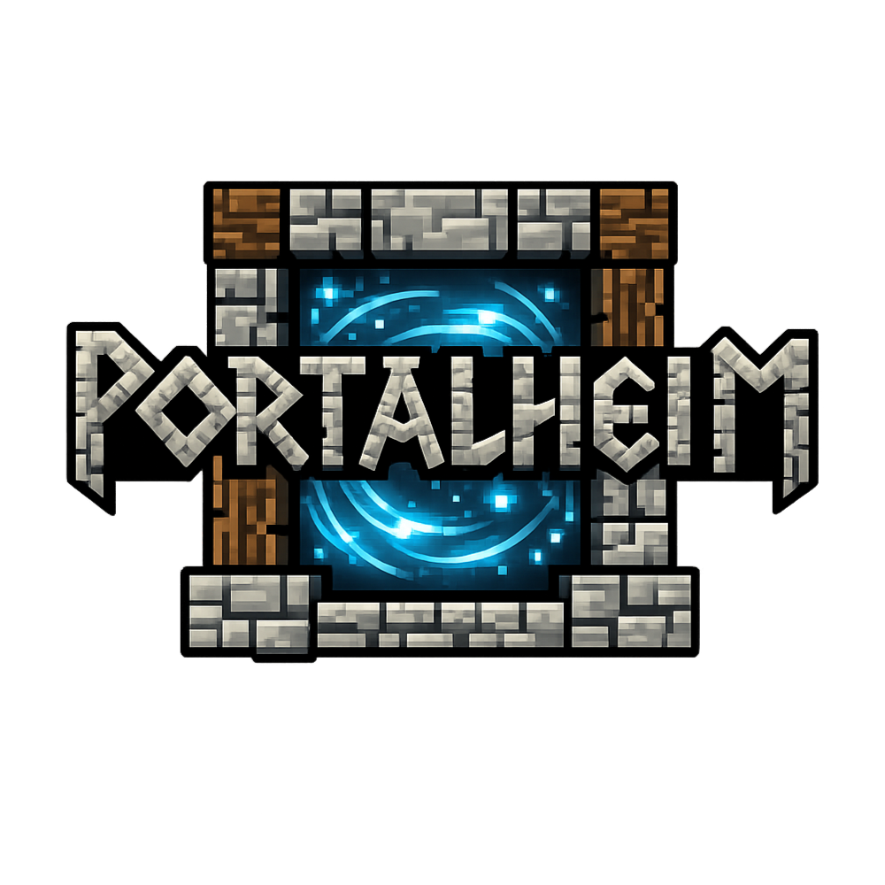

# Portalheim



Portalheim is a Paper plugin that adds Valheim-inspired paired portals to Minecraft. Players build an obsidian portal frame, include at least one `CRYING_OBSIDIAN` block in that frame, attach a wall sign, write a tag on the first line, and walk into the active portal to travel through the Overworld.

## Features

- Nether-portal-style vertical rectangular frames built from `OBSIDIAN`
- At least one `CRYING_OBSIDIAN` block required in every frame
- Sign-based tagging with no commands required for normal use
- Exactly two portals per tag; extra portals with the same tag disable the whole group
- Overworld-only travel
- Warmup, cooldown, particles, and sounds
- Anti-loop protection so players must step out of a destination portal before they can trigger another jump
- Optional Squaremap integration that shows portal icon markers on the web map
- Persistent portal registry in `plugins/Portalheim/portals.yml`
- Admin commands for reload, listing, and inspection

## Build

Requirements:

- JDK 21

Build the plugin jar:

```powershell
.\gradlew.bat build
```

The output jar is written to:

`build/libs/portalheim-0.1.0-SNAPSHOT.jar`

## Install

1. Copy the jar into your Paper server's `plugins` folder.
2. Start the server once to generate the default config.
3. Adjust `plugins/Portalheim/config.yml` if needed.
4. Restart the server or run `/portalheim reload`.

If `squaremap` is installed, Portalheim will also register a `Portalheim` layer and draw each portal as a dedicated icon marker on the map automatically.

## Portal Setup

Build a vertical obsidian portal-style rectangle:

```text
########
#      #
#      #
#      #
########
```

Rules:

- Outer size can match vanilla nether portal rectangles
- Minimum size is `4x5`
- The interior must stay clear
- Use `OBSIDIAN` for the frame, but include at least one `CRYING_OBSIDIAN` block somewhere in that frame
- Attach a wall sign to any frame block
- The sign's front side defines the portal's arrival facing direction

Then:

1. Attach a wall sign to any frame block.
2. Write the portal tag on line 1.
3. Build a second valid portal with the exact same tag.
4. Walk into the portal interior and wait through the warmup.

## Tag Rules

- Tags are trimmed and matched case-insensitively.
- Legacy color codes are stripped before matching.
- Empty tags do not activate.
- Exactly two portals may share a tag.
- If a third portal uses the same tag, all portals with that tag become inactive.

## Commands

- `/portalheim reload`
- `/portalheim list [tag]`
- `/portalheim inspect`

Permission:

- `portalheim.admin`

## Config

Default `config.yml`:

```yaml
warmup-ticks: 30
teleport-cooldown-ticks: 60
particles-enabled: true
sounds-enabled: true
debug-logging: false
```

## Notes

- The plugin only activates portals in the Overworld.
- Portal data is revalidated on startup, chunk load, sign edits, and nearby frame changes.
- The first line of the wall sign is treated as the authoritative portal tag.
- Players must step out of the destination portal before they can trigger another teleport, which prevents standing-loop bounce between linked portals.

## Disclaimer

Yes, this plugin is game breaking. There are other plugins out there that are nicer, better for big servers, integrate with permissions, etc. My main goal was simply giving my tiny family server the ability to explore our pre-generated `16000x16000` world without a ton of pain. All credit to Mojang, Microsoft, Iron Gate Studio, Coffee Stain, etc.
